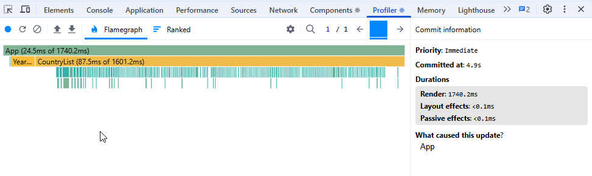
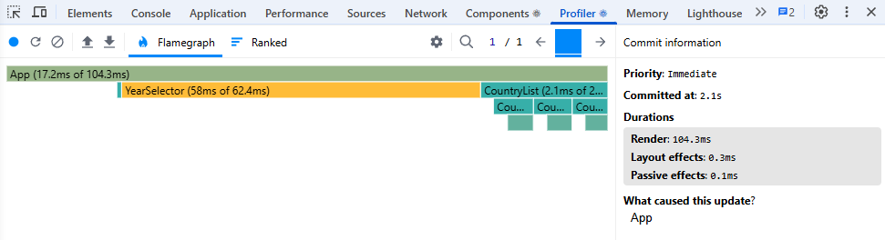
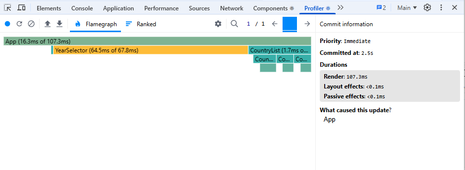
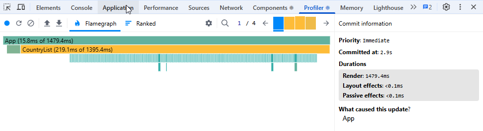
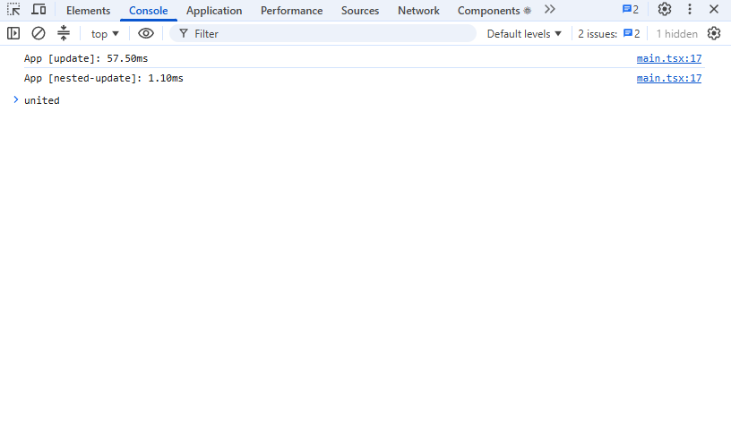
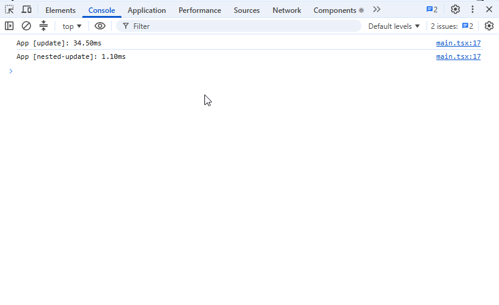
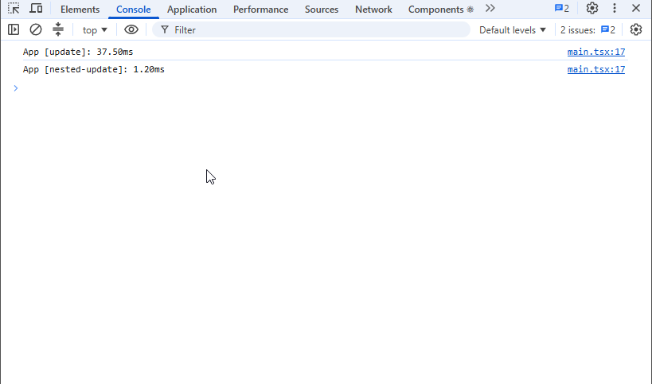
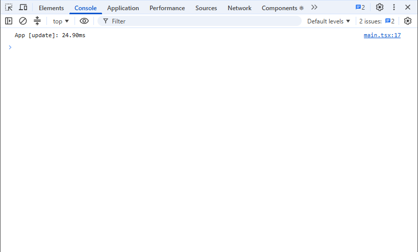

# Performance Optimization Report

## Baseline Measurements

<!-- Сортировка стран -->

### Interaction A: Sort countries

- **Commit duration**: 1.6680 s
- **Render duration**: 1667.8 ms
- **Screenshot**: 

<!-- Поиск стран -->

### Interaction B: Search countries

- **Commit duration**: 0.1094 s
- **Render duration**: 108.8 ms
- **Screenshot**: 

<!-- Смена года -->

### Interaction C: Change year

- **Commit duration**: 0.1075 s
- **Render duration**: 107.3 ms
- **Screenshot**: 

<!-- Переключение колонок -->

### Interaction D: Toggle column

- **Commit duration**: 0.1147 s
- **Render duration**: 114.1 ms
- **Screenshot**: 

<!-- *** ПОСЛЕ ОПТИМИЗАЦИИ *** -->

## Optimized Measurements

### Interaction A: Sort countries

- **Commit duration**: 149.3 s
- **Screenshot**: 

### Interaction B: Search countries

- **Commit duration**: 122.0 s
- **Screenshot**: 

### Interaction C: Change year

- **Commit duration**: 120.7 s
- **Screenshot**: 

### Interaction D: Toggle column

- **Commit duration**: 108.7 s
- **Screenshot**: 

## Summary of Improvements

| Interaction      | Baseline (ms) | Optimized (ms) | Improvement |
| ---------------- | ------------- | -------------- | ----------- |
| Sort countries   | 1667.8        | 57,50          | 96,55%      |
| Search countries | 108.8         | 34,50          | 68,29%      |
| Change year      | 107.3         | 37,50          | 65,05%      |
| Toggle column    | 114.1         | 24,90          | 78,18%      |
| **Average**      | **499.5**     | **38,60**      | **77,02%**  |
